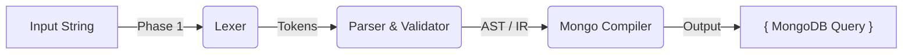

# TS-Mongo Search Parser
### A Type-Safe, AST-Based Search Query Compiler


## 1. Abstract
**ts-mongo-search-parser** is a standalone TypeScript library designed to decouple user search intent from database logic. Unlike traditional "Regex Pipelines" which are fragile and prone to injection errors, this library treats search queries as a mini-language.

It uses a **Lexer/Compiler architecture** to transform human-readable search strings (e.g., `from:me has:link "urgent bug"`) into strict, type-safe MongoDB Aggregation pipelines or Query objects.

## 2. The Problem: "The Regex Pipeline Trap"
Current search implementations in many Mongo-based applications (including parts of Rocket.Chat) often rely on linear Regex pipelines to parse user queries. While functional, these pipelines have critical limitations:

* **Fragility:** Modifying one Regex (e.g., to support quotes) often breaks downstream logic because the string is mutated in-place.
* **No Nested Logic:** A linear pipeline cannot easily understand hierarchical queries like `(from:admin OR priority:high)`.
* **Coupling:** The parsing logic is tightly coupled to the database logic, making unit testing difficult.
* **Type Safety:** The input is treated as a generic string, leading to runtime errors if invalid keys (e.g., `pizza:yummy`) are injected.

## 3. The Solution: Compiler Architecture
We treat the search query not as a string, but as a formal language. We process it in three distinct, testable stages:


## Features Implemented

- **Recursive Descent Parsing**  
  Full support for nested groups using parentheses.

- **Operator Precedence**  
  Correct handling of `AND` vs `OR` priority.

- **Implicit AND**  
  Graceful handling of lazy user input  
  (`deadline passed` → `deadline AND passed`).

- **Quoted Literals**  
  Phrases like `"system failure"` are treated as atomic units.

## Phase 1: Lexer (Tokenizer)

The lexer breaks the raw input string into atomic units called **tokens**.

### Example Input

from:me "fix bug"

### Tokenization Logic

A robust regular expression is used to distinguish between:

- **Keys**

- **Values**

- **Quoted Literals**

- **Free Text**

Any remaining unstructured text that does not match a key–value or quoted pattern.

The lexer performs **no validation or semantic checks**.  
Its sole responsibility is to classify raw input into correctly typed tokens for the next phase.

---

## Phase 2: Parser & Validator

The parser converts tokens into a structured, type-safe **Intermediate Representation (IR)**.

### Responsibilities

- **Validation**

A strict allowlist of supported filter keys is enforced:

['from', 'has', 'mentions']

- **Sanitization**

Invalid filters (e.g. `pizza:yummy`) are **not discarded**.  
Instead, they are gracefully downgraded into standard text search, ensuring that no user intent or data is lost.

- **Type Guarding**

The resulting IR is enforced using TypeScript interfaces (e.g. `ISearchFilters`), guaranteeing that downstream code never receives undefined or malformed data.

---

## Phase 3: Compiler (Mongo Transpiler)

The compiler translates the validated Intermediate Representation into a MongoDB-compatible query object.

### Input (Intermediate Representation)

```json
{
"filters": { "from": "me" },
"text": "fix bug"
}
```
Output (MongoDB Query)
```
{
  $and: [
    { "u.username": "me" },
    { $text: { $search: "fix bug" } }
  ]
}
```
---

## Usage Example

```typescript
import { Lexer } from './src/lexer';
import { Parser } from './src/parser';
import { Compiler } from './src/compiler';

const query = 'status:open (urgent OR "server crash")';

// 1. Lexing
const tokens = new Lexer(query).tokenize();

// 2. Parsing (AST Generation)
const ast = new Parser(tokens).parse();

// 3. Compilation (MongoDB Query)
const mongoQuery = new Compiler().compile(ast);

console.log(JSON.stringify(mongoQuery, null, 2));
```
Output
```
{
  $and: [
    { 'u.username': 'admin' },
    { 'urls': { $exists: true } },
    { $text: { $search: '"server crash"' } }
  ]
}
```
Installation & Setup
```
# Clone the repository
git clone https://github.com/devkarx/ts-mongo-search-parser.git

# Enter the project directory
cd ts-mongo-search-parser

# Install dependencies
npm install

# Run tests
npm run demo

```
Project Structure
```
ts-mongo-search-parser/
├── src/
│   ├── ast.ts        # AST node definitions
│   ├── compiler.ts   # MongoDB query compiler (AST → MongoDB)
│   ├── demo.ts       # Demo file containing complex search queries
│   ├── index.ts      # Public entry point
│   ├── lexer.ts      # Tokenization logic
│   ├── parser.ts     # Recursive Descent Parser
│   └── types.ts      # Shared types and interfaces
├── tests/            # Test suite (currently empty)
├── package.json      # Project metadata, scripts, and dependencies
└── README.md         # Project documentation

```
## Future Roadmap

- [ ] **Field Mapping:** Map generic keys (`from`) to database fields (`u.username`).
- [ ] **Date Parsing:** Specialized compiler support for `after:YYYY-MM-DD`.
- [ ] **Rocket.Chat Adapter:** Drop-in wrapper for direct integration with Rocket.Chat Core.
      
## Maintainer 
Maintained by Aradhy 


